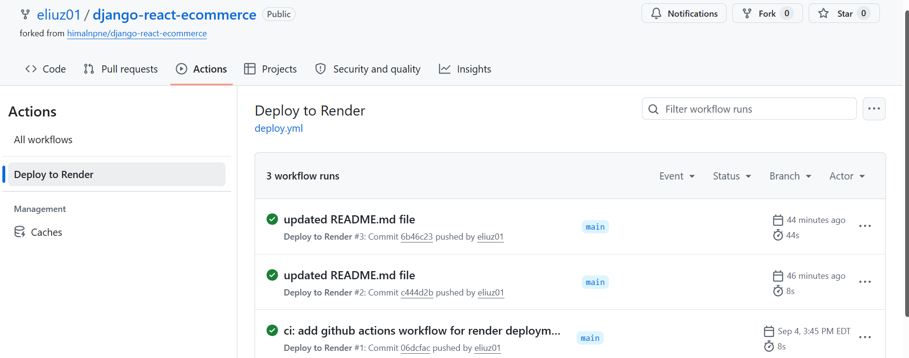
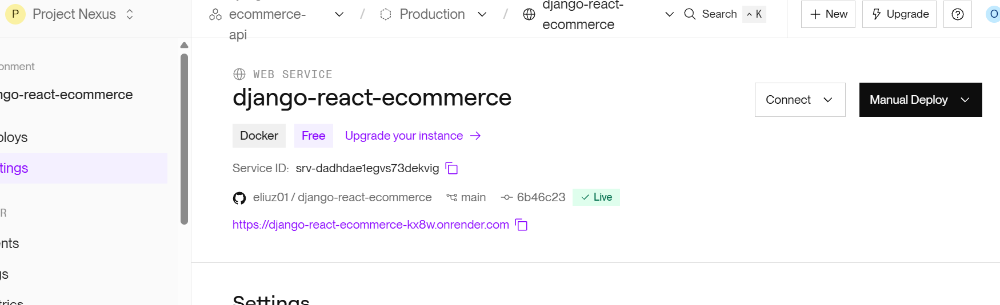
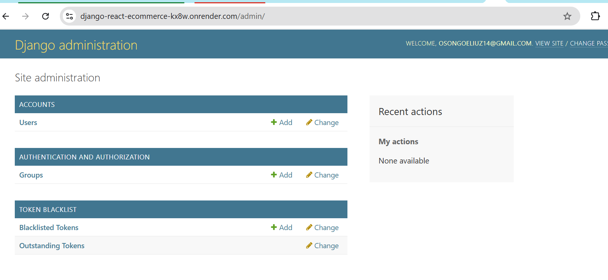
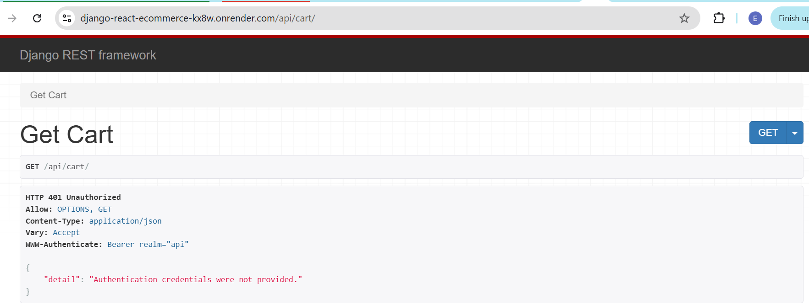
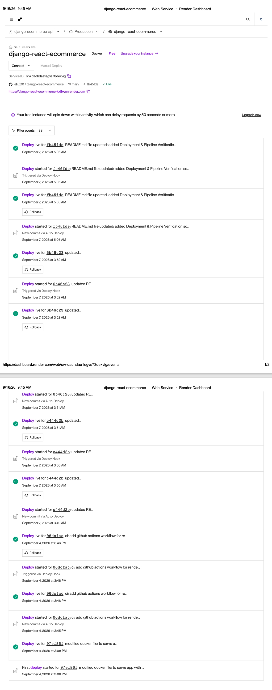

# Django E-Commerce Backend API & DevOps Pipeline

A production-ready Django REST API backend for an e-commerce application. This project features containerization with Docker, managed PostgreSQL database provisioning on Render, and fully automated continuous deployment (CI/CD) via GitHub Actions.

## Live Production Links

* **Live API Base URL:** `https://django-react-ecommerce-kx8w.onrender.com/`
* **Django Admin Panel:** `https://django-react-ecommerce-kx8w.onrender.com/admin/`

---

## Tech Stack & Infrastructure

* **Language & Framework:** Python 3.12, Django 5.2, Django REST Framework
* **Production Application Server:** Gunicorn, WhiteNoise (Static File Serving)
* **Authentication:** JWT (Django REST Framework SimpleJWT)
* **Database:** PostgreSQL 15 (Managed on Render)
* **Containerization:** Docker
* **Hosting Platform:** Render (PaaS - US West Oregon)
* **CI/CD Automation:** GitHub Actions (Deploy Hook Trigger)

---

## Project Structure

```text
django-react-ecommerce/
├── .github/
│   └── workflows/
│       └── deploy.yml      # GitHub Actions CI/CD workflow
├── accounts/
├── cart/
├── orders/
├── products/
├── testing/
├── ecommerce_project/
├── Dockerfile              # Production Docker build configuration
├── manage.py
├── requirements.txt
├── README.md
└── LICENSE
```

## Prerequisites

* Python 3.12+
* Docker Desktop
* Git
* Render Account & GitHub Account

## Local Setup

### 1. Clone the Repository

```bash
git clone [https://github.com/eliuz01/django-react-ecommerce.git](https://github.com/eliuz01/django-react-ecommerce.git)
cd django-react-ecommerce
```

### 2. Create Virtual Environment

```bash
python -m venv venv
source venv/Scripts/activate
```

### 3. Install Dependencies

```bash
pip install -r requirements.txt
```

### 4. Configure Environment Variables

Set the following environment variables:

```env
SECRET_KEY=your-secret-key
DEBUG=True
DB_NAME=ecommerce_db
DB_USER=ecommerce_user
DB_PASSWORD=your-password
DB_HOST=localhost
DB_PORT=5432
```

### 5. Run Migrations

```bash
python manage.py migrate
```

### 6. Create Admin User

```bash
python manage.py createsuperuser
```

### 7. Run the Application

```bash
python manage.py runserver
```

Access the application at:

```text
http://127.0.0.1:8000
```

## Docker Setup

### 1. Start PostgreSQL

```bash
docker run --name ecommerce-db \
  --network ecommerce-network \
  -e POSTGRES_DB=ecommerce_db \
  -e POSTGRES_USER=ecommerce_user \
  -e POSTGRES_PASSWORD=your-password \
  -p 5432:5432 \
  -d postgres:15
```

### 2. Create Docker Network

```bash
docker network create ecommerce-network
docker network connect ecommerce-network ecommerce-db
```

### 3. Build Django Image

```bash
docker build -t django-ecommerce-backend .
```

### 4. Run Django Container

```bash
docker run -d --name django-app \
  -p 8000:8000 \
  --network ecommerce-network \
  -e DB_NAME=ecommerce_db \
  -e DB_USER=ecommerce_user \
  -e DB_PASSWORD=your-password \
  -e DB_HOST=ecommerce-db \
  -e DB_PORT=5432 \
  django-ecommerce-backend
```

### 5. Run Migrations

```bash
docker exec django-app python manage.py migrate
```

### 6. Check Running Containers

```bash
docker ps
```

The PostgreSQL and Django containers should be running.

## API Endpoints

| Endpoint              | Method   | Description           |
| --------------------- | -------- | --------------------- |
| `/admin/`             | GET      | Django admin panel    |
| `/api/products/`      | GET      | List products         |
| `/api/products/<id>/` | GET      | Retrieve a product    |
| `/api/cart/`          | GET/POST | View or add to cart   |
| `/api/orders/`        | GET/POST | View or create orders |
| `/api/token/`         | POST     | Obtain JWT token      |
| `/api/token/refresh/` | POST     | Refresh JWT token     |

## Environment Variables

| Variable      | Description              |
| ------------- | ------------------------ |
| `SECRET_KEY`  | Django secret key        |
| `DEBUG`       | Django debug mode        |
| `DB_NAME`     | PostgreSQL database name |
| `DB_USER`     | PostgreSQL username      |
| `DB_PASSWORD` | PostgreSQL password      |
| `DB_HOST`     | PostgreSQL host          |
| `DB_PORT`     | PostgreSQL port          |

> **Security:** Do not commit `.env` files or real database passwords to GitHub.

## Testing

Run Django tests with:

```bash
python manage.py test
```

## Screenshots

### Docker Containers


### Django Application


### Django Admin


## Deployment & Pipeline Verification

### CI/CD Workflow Execution


### Live Web Service Status (Render)


### Production Django Admin Interface


### Production API Endpoint Response



## License

MIT License

## Acknowledgments

Original project by himalnpne.

Modified and containerized as part of a DevOps internship project.

## Task 3: Monitoring, Automation & Incident Response

## Step 1: Application Monitoring Setup

Monitoring for the deployed application is handled through Render’s native observability tools:

* **Application Availability**: Tracked via Render's **Events** log, which records instance startup times, continuous deployment events, and uptime status.
  


* **Error Logging & Traffic:** Monitored via the **Logs** tab, streaming real-time Gunicorn access logs and Django HTTP status responses (e.g., `200 OK`, `401 Unauthorized`, `500 Server Error`).
  


* **Network & Resource Metrics:** Monitored via the **Metrics** dashboard, tracking bandwidth outbound data transfer and instance traffic spikes.

### Step 2: Automation 

## Step 2: Automation Improvements

To streamline deployment workflows, ensure application reliability, and reduce manual operational overhead, two core automation mechanisms were implemented:

### 1. Automatic Continuous Deployments via Webhooks
* **Implementation:** Integrated GitHub Actions with Render PaaS using automated Deploy Hooks.
* **Mechanism:** Upon a successful push or pull request merge to the `main` branch, GitHub Actions executes a POST request to Render’s deploy hook URL. Render automatically pulls the latest commit, builds the updated Docker image, and deploys it without human intervention.
* **Benefit:** Eliminates manual SSH/deployment steps, reduces release time from minutes to seconds, and ensures that code running in production always reflects the latest validated commit on `main`.

### 2. Automated Health Checks and Container Restart Policies

* **Implementation:** Configured container health check probes and automated process managers (Gunicorn + Docker runtime) within the cloud platform.
  
* **Mechanism:** Render continuously performs HTTP ping checks against the root application routes (`/admin/` and `/api/cart/`). If Gunicorn encounters an unhandled exception or the container crashes (e.g., due to memory spikes or unhandled runtime errors), the platform automatically restarts the Docker container.
  
* **Benefit:** Guarantees self-healing infrastructure, keeping application downtime to a minimum without requiring manual sysadmin intervention during transient failures.