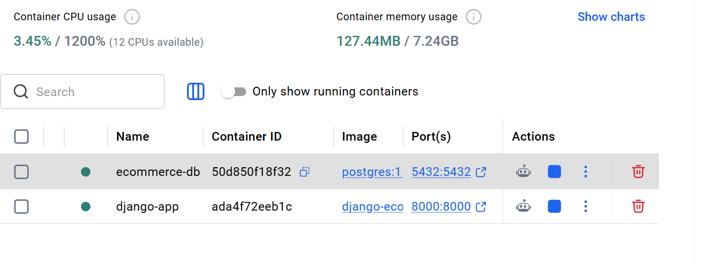
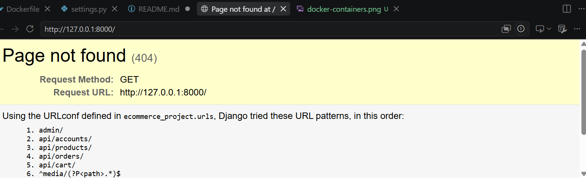
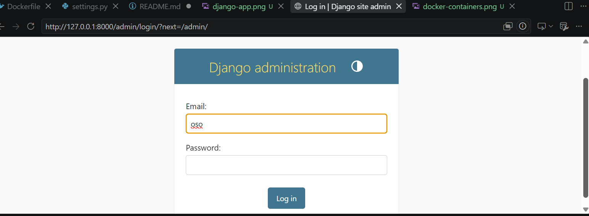

# Django E-Commerce Backend API

A Django REST API backend for an e-commerce application. The project uses PostgreSQL for data storage and Docker for containerization.

## Tech Stack

* Python 3.12
* Django 5.2
* Django REST Framework
* PostgreSQL 15
* Docker
* JWT Authentication

## Project Structure

```text
django-react-ecommerce/
├── accounts/
├── cart/
├── orders/
├── products/
├── testing/
├── ecommerce_project/
├── Dockerfile
├── manage.py
├── requirements.txt
├── README.md
└── LICENSE
```

## Prerequisites

* Python 3.12+
* Docker Desktop
* Git

## Local Setup

### 1. Clone the Repository

```bash
git clone https://github.com/eliuz01/django-react-ecommerce.git
cd django-react-ecommerce
```

### 2. Create Virtual Environment

```bash
python -m venv venv
source venv/Scripts/activate
```

### 3. Install Dependencies

```bash
pip install -r requirements.txt
```

### 4. Configure Environment Variables

Set the following environment variables:

```env
SECRET_KEY=your-secret-key
DEBUG=True
DB_NAME=ecommerce_db
DB_USER=ecommerce_user
DB_PASSWORD=your-password
DB_HOST=localhost
DB_PORT=5432
```

### 5. Run Migrations

```bash
python manage.py migrate
```

### 6. Create Admin User

```bash
python manage.py createsuperuser
```

### 7. Run the Application

```bash
python manage.py runserver
```

Access the application at:

```text
http://127.0.0.1:8000
```

## Docker Setup

### 1. Start PostgreSQL

```bash
docker run --name ecommerce-db \
  -e POSTGRES_DB=ecommerce_db \
  -e POSTGRES_USER=ecommerce_user \
  -e POSTGRES_PASSWORD=your-password \
  -p 5432:5432 \
  -d postgres:15
```

### 2. Create Docker Network

```bash
docker network create ecommerce-network
docker network connect ecommerce-network ecommerce-db
```

### 3. Build Django Image

```bash
docker build -t django-ecommerce-backend .
```

### 4. Run Django Container

```bash
docker run -d --name django-app \
  -p 8000:8000 \
  --network ecommerce-network \
  -e DB_NAME=ecommerce_db \
  -e DB_USER=ecommerce_user \
  -e DB_PASSWORD=your-password \
  -e DB_HOST=ecommerce-db \
  -e DB_PORT=5432 \
  django-ecommerce-backend
```

### 5. Run Migrations

```bash
docker exec django-app python manage.py migrate
```

### 6. Check Running Containers

```bash
docker ps
```

The PostgreSQL and Django containers should be running.

## API Endpoints

| Endpoint              | Method   | Description           |
| --------------------- | -------- | --------------------- |
| `/admin/`             | GET      | Django admin panel    |
| `/api/products/`      | GET      | List products         |
| `/api/products/<id>/` | GET      | Retrieve a product    |
| `/api/cart/`          | GET/POST | View or add to cart   |
| `/api/orders/`        | GET/POST | View or create orders |
| `/api/token/`         | POST     | Obtain JWT token      |
| `/api/token/refresh/` | POST     | Refresh JWT token     |

## Environment Variables

| Variable      | Description              |
| ------------- | ------------------------ |
| `SECRET_KEY`  | Django secret key        |
| `DEBUG`       | Django debug mode        |
| `DB_NAME`     | PostgreSQL database name |
| `DB_USER`     | PostgreSQL username      |
| `DB_PASSWORD` | PostgreSQL password      |
| `DB_HOST`     | PostgreSQL host          |
| `DB_PORT`     | PostgreSQL port          |

> **Security:** Do not commit `.env` files or real database passwords to GitHub.

## Testing

Run Django tests with:

```bash
python manage.py test
```

## Screenshots

### Docker Containers


### Django Application


### Django Admin



## License

MIT License

## Acknowledgments

Original project by himalnpne.

Modified and containerized as part of a DevOps internship project.

